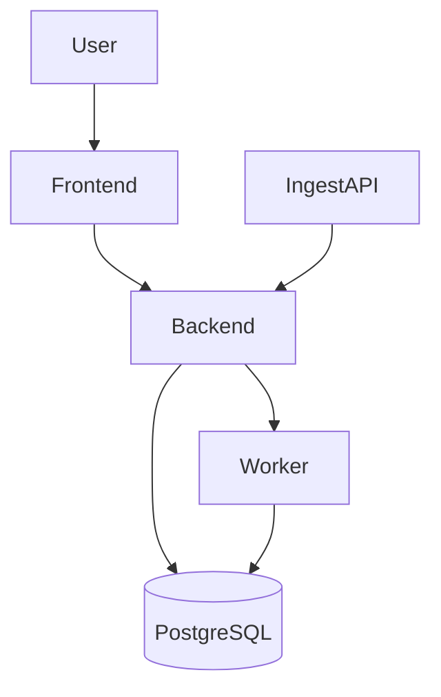
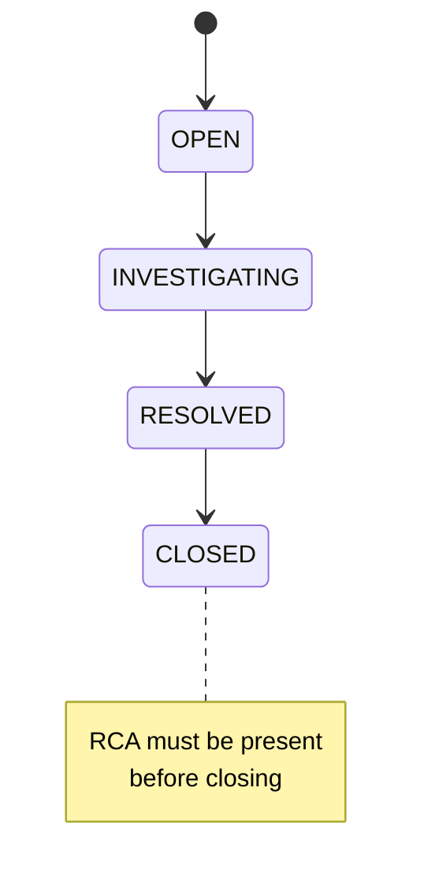
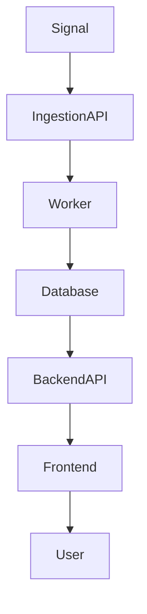

# ⚡ Incident Management System (IMS)

A production-style Incident Management System built using FastAPI, React, and Docker.  
This project simulates real-world infrastructure failure handling, incident lifecycle management, and RCA workflows.

---

## 🎯 Objective

The goal of this system is to:

- Ingest failure signals from infrastructure
- Automatically create incidents
- Track incident lifecycle
- Enforce Root Cause Analysis (RCA) before closure
- Demonstrate system reliability concepts like backpressure handling

---

## 🧱 Tech Stack

| Layer      | Technology              |
|------------|------------------------|
| Frontend   | React + TailwindCSS    |
| Backend    | FastAPI (Python)       |
| Database   | PostgreSQL             |
| Infra      | Docker + Docker Compose|
| Processing | Worker-based simulation|

---

## 🏗️ Architecture



---

## ⚙️ Setup Instructions

### 1. Clone the Repository

```bash
git clone https://github.com/SwedeshnaMishra/Mission-Critical-Incident-Management-System.git
cd Mission-Critical-Incident-Management-System
```

### 2. Start Backend (Docker)

```bash
docker-compose up --build
```

This will start:
- FastAPI backend
- PostgreSQL database

### 3. Start Frontend (React)

Open a new terminal:

```bash
cd frontend
npm install
npm start
```

Frontend will run at:

http://localhost:3000

---

## 🌐 Access URLs

| Service          | URL                        |
|------------------|---------------------------|
| Frontend (React) | http://localhost:3000     |
| Backend API Docs | http://localhost:8000/docs|

---

## 🚀 How to Use

### ✅ Step 1 — Open Dashboard

Go to:

http://localhost:3000


👉 On startup, the system **automatically creates a sample incident (auto-seeded)**  
This ensures the dashboard is not empty and can be explored immediately.

---

### ✅ Step 2 — View Incident

- Click on any incident card  
- Opens detailed incident page  

---

### ✅ Step 3 — Add RCA

Fill in:
- Root Cause  
- Fix Applied  
- Prevention Steps  

Click:
```
Submit RCA
```

---

### ✅ Step 4 — Close Incident

Click:
```
Close Incident
```


System ensures:
- ❌ Cannot close without RCA  
- ✅ Valid lifecycle transition  

---

## 🔄 Optional: Manual Signal Ingestion

You can simulate real infrastructure failures manually.

### Step 1 — Open API Docs

http://localhost:8000/docs


---

### Step 2 — Use Signal API

Endpoint:

```
POST /signals
```

---

### Step 3 — Send Example Payload

```json
{
  "component_id": "DB_CLUSTER",
  "severity": "P1",
  "message": "Database outage",
  "timestamp": 1710000000
}
```

---

### 🔁 What Happens Internally
- Signal is ingested by backend
- Worker processes the signal
- New incident is created
- Dashboard updates automatically

---

💡 This simulates real-world monitoring systems where failures generate incidents dynamically.

---

## ✅ Expected Output

- Dashboard shows at least one incident (auto-seeded)
- Clicking incident opens detailed view
- RCA submission updates the incident
- Incident can only be closed after RCA

This ensures the system is working correctly end-to-end.

---

## 📁 Sample Data

Location:

```bash
sample-data/sample_signal.json
```

Example:

```json
{
  "component_id": "CACHE_CLUSTER_01",
  "severity": "P2",
  "message": "Cache spike",
  "timestamp": 1710000000
}
```

---

## 🔄 Incident Lifecycle

OPEN → INVESTIGATING → RESOLVED → CLOSED

### Rules
- Cannot skip states (must follow order)
- RCA is mandatory before moving to CLOSED

(Note: Lifecycle states are enforced programmatically in backend via state manager)

## 🔄 Incident Lifecycle (State Diagram)



---

## 🔄 Allowed Transitions

```python
ALLOWED_TRANSITIONS = {
    "OPEN": ["INVESTIGATING"],
    "INVESTIGATING": ["RESOLVED"],
    "RESOLVED": ["CLOSED"],
    "CLOSED": []
}
```

---

## ⚡ Backpressure Handling

### Problem
- In a real-world system, a large number of failure signals can arrive simultaneously.  
- If processed directly, this can overload the backend and database.
- In this implementation, backpressure is simulated using a worker-based asynchronous processing model, ensuring ingestion is decoupled from persistence.

---

### Solution
This system simulates backpressure handling using:

- Worker-based processing  
- Decoupled ingestion and processing  
- Controlled data flow  

---

### System Flow

> Signal → Ingestion API → Worker → Database → UI



---

### 🧠 Strategy

To handle high-volume signal ingestion and prevent system overload, the following strategy is implemented:

- **Decoupled Processing**  
  Signal ingestion and processing are separated. The API accepts incoming signals quickly, while a worker handles processing asynchronously.

- **Asynchronous Workflow**  
  Signals are processed in the background instead of blocking API requests, ensuring fast response times.

- **Controlled Throughput**  
  The worker processes signals at a manageable rate, preventing sudden spikes from overwhelming the database.

- **Batch-like Handling**  
  Multiple signals are handled over time instead of instant bulk writes, reducing load on persistence layers.

- **Fail-Safe Behavior**  
  Even if the database slows down, the ingestion layer continues to accept signals without crashing.

---

### 🎯 Outcome

- Improved system stability under load  
- Better handling of traffic spikes  
- Reduced risk of database failure  
- Scalable architecture ready for real queue systems (Kafka / Redis Streams)

---

### ✅ Benefits

- Prevents database crashes  
- Improves system stability under load  
- Handles high-throughput scenarios gracefully  
- Mimics real-world queue-based systems (Kafka / Redis Streams)  

---

## 🧠 Non-Functional Improvements (Bonus Points)

### 🔐 Security
- Input validation using Pydantic schemas  
- Controlled state transitions (no invalid status updates)  
- Prevents incorrect or malicious data entry  

---

### ⚡ Performance
- Lightweight API responses  
- Efficient database queries  
- Reduced unnecessary data transfer  

---

### 📈 Scalability
- Worker-based architecture allows horizontal scaling  
- Can be extended with:
  - Kafka  
  - Redis queues  
  - Message brokers  

---

### 🧩 Reliability
- RCA enforcement before closing incidents  
- Ensures complete resolution tracking  
- Prevents premature closure  

---

### 💡 UX Improvements
- Auto-seeded data for instant demo  
- Loading indicators for better experience  
- Error handling for failed API calls  
- Clean and responsive UI  

---

## 📸 Screenshots

### Dashboard


---

### Incident Page


---

## 📦 Project Structure

```bash
IMS-System/
│
├── backend/
│   ├── app/
│   │   ├── api/
│   │   │   ├── ingest.py
│   │   │   └── work_item.py
│   │   │
│   │   ├── models/
│   │   │   ├── work_item.py
│   │   │   └── rca.py
│   │   │
│   │   ├── schemas/
│   │   │   └── rca.py
│   │   │
│   │   ├── services/
│   │   │   ├── db.py
│   │   │   ├── state_manager.py
│   │   │   └── worker.py
│   │   │
│   │   └── main.py
│   │
│   ├── requirements.txt
│   ├── Dockerfile
│
├── frontend/
│   ├── src/
│   │   ├── pages/
│   │   │   ├── Home.js
│   │   │   └── Incident.js
│   │   │
│   │   ├── services/
│   │   │   └── api.js
│   │   │
│   │   ├── components/
│   │   │   ├── SeverityBadge.js
│   │   │   └── StatusBadge.js
│   │   │
│   │   └── App.js
│   │
│   ├── package.json
│   ├── tailwind.config.js
│   ├── postcss.config.js
│   ├── Dockerfile
│
├── sample-data/
│   └── sample_signal.json
│
├── docs/
│   ├── architecture.png 
│   ├── ui-home.png
│   └── ui-incident.png
│
├── prompts/
│   └── prompts.md
│
├── docker-compose.yml
├── .gitignore
├── README.md
```

Note: Redis/Mongo clients are included as placeholders for future scalability extensions.

---

## 🧠 Prompts Used

Location:

```bash
prompts/prompts.md
```

### Backend Design
- Design FastAPI-based incident system with RCA enforcement

### API Design
- Create REST APIs for incident lifecycle
- Add validation rules for status transitions

### Frontend
- Build dashboard UI with React and Tailwind
- Add RCA submission form

### Improvements
- Add auto-seed data
- Improve UI/UX
- Add error handling

---

## 🚀 Future Improvements

- Authentication (JWT)  
- Role-based access control  
- Real-time updates (WebSockets)  
- Alert integrations (Slack / Email)  
- Monitoring dashboards  

---

## For Contributing
If you want to contribute to this project, please follow these steps:
- `Fork` the repository.
- Create a new branch `(git checkout -b feature/your-feature-name)`.
- Make your changes and commit them `(git commit -m 'Add some feature')`.
- Push to the branch `(git push origin feature/your-feature-name)`.
- Open a pull request.

---

## Project Maintainer
**Github:** [Swedeshna Mishra](https://github.com/SwedeshnaMishra)
